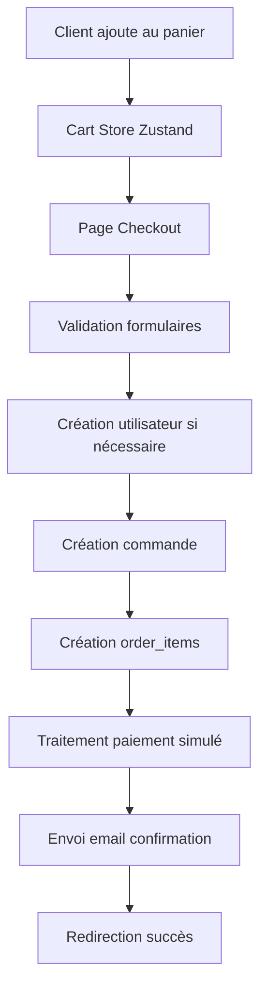

# 🏗️ Architecture SneakHouse

## Vue d'ensemble

SneakHouse est construite avec une architecture moderne basée sur Next.js 15 et Supabase, offrant une expérience full-stack performante et scalable.

## Stack Technique Détaillée

### Frontend
- **Next.js 15.5.4** - Framework React avec App Router
- **TypeScript 5** - Typage statique pour la robustesse
- **Tailwind CSS** - Framework CSS utility-first
- **Headless UI** - Composants accessibles sans style
- **Heroicons** - Icônes SVG optimisées
- **Framer Motion** - Animations fluides

### Backend & Base de Données
- **Supabase** - Backend-as-a-Service
  - PostgreSQL - Base de données relationnelle
  - Auth - Gestion d'authentification
  - Storage - Stockage de fichiers
  - Real-time - Mises à jour temps réel

### État Global
- **Zustand** - Gestion d'état minimaliste
  - Cart Store - Panier utilisateur
  - Auth Store - État d'authentification

### Communications
- **Nodemailer** - Envoi d'emails transactionnels
- **React Hot Toast** - Notifications utilisateur

## Architecture des Composants

### Structure Hiérarchique

```
App
├── Layout Global (RootLayout)
├── Pages Publiques
│   ├── Homepage (/)
│   ├── Catalogue (/sneakers)
│   ├── Produit (/produit/[slug])
│   ├── Checkout (/checkout)
│   └── Compte (/compte)
├── Admin Layout (/admin/*)
│   ├── Dashboard
│   ├── Users Management
│   ├── Products Management
│   ├── Orders Management
│   └── Analytics
└── Vendor Layout (/vendeur/*)
    ├── Dashboard
    ├── Orders Management
    ├── Products Management
    ├── Stock Management
    └── Analytics
```

### Composants Réutilisables

#### Components/UI
- `Button` - Bouton stylé avec variants
- `Input` - Champ de saisie uniforme
- `Modal` - Modal réutilisable
- `Loading` - Indicateurs de chargement

#### Components/Admin
- `AdminLayout` - Layout spécifique admin
- `AdminSidebar` - Navigation admin
- `StatsCard` - Cartes de statistiques
- `DataTable` - Tables de données

#### Components/Vendor
- `VendorLayout` - Layout spécifique vendeur
- `VendorSidebar` - Navigation vendeur
- `ProductCard` - Carte produit
- `OrderRow` - Ligne de commande

## Architecture de Données

### Modèle de Base de Données

```sql
-- Utilisateurs et rôles
users (id, email, role, first_name, last_name, phone, is_active)
  ├── role: 'customer' | 'vendor' | 'admin'
  └── relations: orders, payments

-- Catalogue produits
brands (id, name, description)
categories (id, name, description)
products (id, name, description, brand_id, category_id, base_price, gender)
  └── product_variants (id, product_id, sku, color, price, image_url)

-- Commandes et paiements
orders (id, order_number, user_id, status, total_amount, shipping_address)
  ├── order_items (id, order_id, variant_id, product_name, quantity, unit_price)
  └── payments (id, order_id, amount, status, payment_method, transaction_id)
```

### Relations Principales

```
Users (1) ←→ (N) Orders ←→ (N) Order_Items
Products (1) ←→ (N) Product_Variants
Brands (1) ←→ (N) Products
Categories (1) ←→ (N) Products
Orders (1) ←→ (1) Payment
```

## Flux de Données

### Processus de Commande



### Gestion des États

```typescript
// Cart Store (Zustand)
interface CartState {
  items: CartItem[]
  addItem: (item: CartItem) => void
  removeItem: (id: string) => void
  updateQuantity: (id: string, quantity: number) => void
  clearCart: () => void
  getTotal: () => number
}

// Types principaux
interface CartItem {
  variant: ProductVariant
  size: Size
  quantity: number
}
```

## Sécurité & Permissions

### Row Level Security (RLS)

```sql
-- Actuellement désactivé pour développement
ALTER TABLE users DISABLE ROW LEVEL SECURITY;

-- En production, activer avec politiques :
-- Utilisateurs peuvent voir leurs propres données
-- Admins peuvent tout voir
-- Vendeurs peuvent voir les commandes assignées
```

### Authentification

- **Mode développement** : Pas d'auth complète
- **Roles simulés** : Via localStorage ou session
- **À implémenter** : Supabase Auth avec JWT

## Performance & Optimisation

### Stratégies Next.js

- **App Router** - Routing optimisé
- **Server Components** - Rendu côté serveur
- **Image Optimization** - Images Next.js optimisées
- **Code Splitting** - Chargement à la demande

### Base de Données

- **Indexation** sur les colonnes fréquemment requêtées
- **Pagination** des listes longues
- **Requêtes optimisées** avec select spécifiques

### Cache & État

- **React Query** (à implémenter) pour cache serveur
- **Zustand** pour état local persistant
- **Local Storage** pour panier persistant

## Déploiement & Infrastructure

### Environnements

```
Development  → localhost:3000 (Next.js dev)
Staging      → Vercel preview branches
Production   → Vercel main branch
```

### Variables d'Environnement

```env
# Supabase
NEXT_PUBLIC_SUPABASE_URL=          # URL publique
NEXT_PUBLIC_SUPABASE_ANON_KEY=     # Clé anonyme publique

# Email
EMAIL_HOST=smtp.gmail.com          # Serveur SMTP
EMAIL_USER=                        # Email expéditeur
EMAIL_PASSWORD=                    # Mot de passe app
EMAIL_FROM=                        # Adresse FROM
```

## Monitoring & Logging

### Logs de Développement
- `console.log` pour debugging
- Toast notifications pour feedback utilisateur
- Error boundaries pour capture d'erreurs

### À Implémenter
- Sentry pour monitoring erreurs
- Analytics pour métriques utilisateur
- Performance monitoring

## Évolutivité

### Architecture Modulaire
- Composants découplés et réutilisables
- Séparation claire des responsabilités
- API routes extensibles

### Patterns Utilisés
- **Container/Presentation** - Séparation logique/affichage
- **Custom Hooks** - Logique réutilisable
- **Provider Pattern** - Partage d'état
- **Repository Pattern** - Abstraction données

### Migration Path
- Authentification complète Supabase
- API REST documentée
- Tests automatisés
- CI/CD pipeline
- Monitoring production

## Diagramme d'Architecture

```
┌─────────────────┐    ┌─────────────────┐    ┌─────────────────┐
│   Client Web    │    │   Next.js App   │    │   Supabase      │
│                 │    │                 │    │                 │
│ • Browser       │◄──►│ • App Router    │◄──►│ • PostgreSQL    │
│ • React         │    │ • API Routes    │    │ • Auth          │
│ • Zustand       │    │ • Server Comp.  │    │ • Storage       │
│ • Tailwind      │    │ • TypeScript    │    │ • Realtime      │
└─────────────────┘    └─────────────────┘    └─────────────────┘
         │                       │                       │
         │                       │                       │
         ▼                       ▼                       ▼
┌─────────────────┐    ┌─────────────────┐    ┌─────────────────┐
│   External      │    │   Email Service │    │   File Storage  │
│   Services      │    │                 │    │                 │
│ • Stripe API    │    │ • Nodemailer    │    │ • Images        │
│ • Email SMTP    │    │ • Templates     │    │ • Documents     │
└─────────────────┘    └─────────────────┘    └─────────────────┘
```

Cette architecture garantit :
- **Scalabilité** - Capacité à gérer la croissance
- **Maintenabilité** - Code organisé et documenté
- **Performance** - Optimisations Next.js et caching
- **Sécurité** - Bonnes pratiques et validation
- **Expérience utilisateur** - Interface moderne et responsive